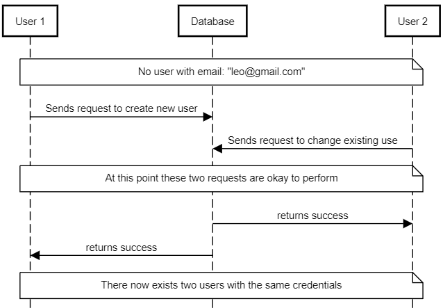
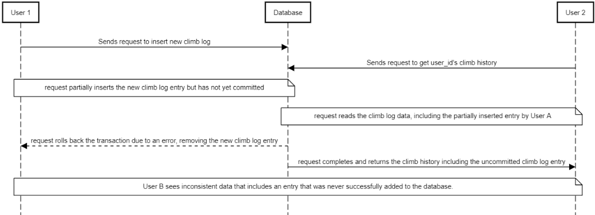
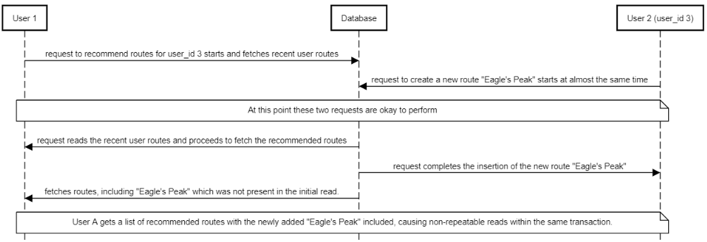

Case 1: 
    
    Phenomenon: Lost Update
    Scenario:

        Two users using the app at the same time, and perform the following operations almost simultaneously

            User A sends a request to create a new user with the name "Leo", email "leo@gmail.com" and has an age of 23
            User B sends a request to update their user profile for user_id 1 (which is not leo) and changes their name to "Leo",
                email to "leo@gmail.com" and age to 23
                
        
    Consequence:
        Without concurrency control there would be many different possible outcomes, one of which being
            User A's initial request starts
            User B's request starts at almost the same time
            User A's request reads the email of "leo@gmail.com" as unique and valid
            User B updates the user with userid 1 to have the email "leo@gmail.com"
            User A's request completes the creation of a new user (unaware of the update made by User B)

Case 2: 

    Phenomenon: Dirty Read
    Scenario:

        Two users using the app at the same time, and perform the following operations almost simultaneously

            User A sends a request to create a new climb log entry with user_id 2, route_id 5, frequency 3, intensity 4, 
                heart_rate 120, systolic_pressure 110, diastolic_pressure 70.
            User B sends a request to retrieve the climb history for user_id 2.

    Consequence:
        Without concurrency control there would be many different possible outcomes, one of which being:
            User A's request to insert a new climb log starts.
            User B's request to get user_id 2's climb history starts at almost the same time.
            User A's request partially inserts the new climb log entry but has not yet committed.
            User B's request reads the climb log data, including the partially inserted entry by User A.
            User A's request rolls back the transaction due to an error, removing the new climb log entry.
            User B's request completes and returns the climb history including the uncommitted climb log entry.
            User B sees inconsistent data that includes an entry that was never successfully added to the database.

Case 3: 

    Phenomenon: Non-repeatable Read
    Scenario:

        Two users using the app at the same time, and perform the following operations almost simultaneously:

            User A sends a request to get recommended climbing routes for user_id 3.
            User B sends a request to create a new route with the name "Eagle's Peak", location "Rocky Mountains", grade "5.10b", ...

    Consequence:
        Without concurrency control there would be many different possible outcomes, one of which being:
            User A's request to recommend routes for user_id 3 starts and fetches recent user routes.
            User B's (user_id 3) request to create a new route "Eagle's Peak" starts at almost the same time.
            User A's request reads the recent user routes and proceeds to fetch the recommended routes.
            User B's request completes the insertion of the new route "Eagle's Peak".
            User A's request fetches the recommended routes, including the newly added "Eagle's Peak" which was not present in the initial read.
            User A gets a list of recommended routes with the newly added "Eagle's Peak" included, causing non-repeatable reads within the same transaction.

    

    